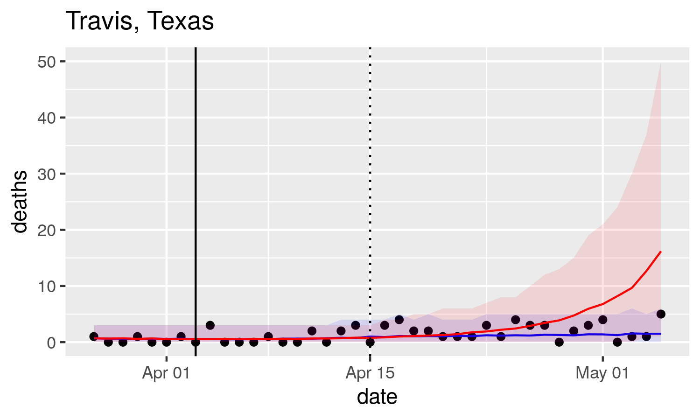

It is clear that lockdown has mitigated the spread of the 2019 novel coronavirus, but there is uncertainty by how much. During the first wave of Covid-19 there was an immediate need for models to determine the potential extent of the spread with stay at home orders in place. 

Now that we are leaving the first peak behind us, the priority of policy makers and modelers in the US has shifted towards quantifying the effect of lifting restrictions to maintain the epidemic's second wave under control.

Understanding the anatomy of mobility in each US county and measuring the causal effect of lockdown and other interventions on Covid-19 spread is key in guiding quick responses and identifying their risk while reopening the economy during this pandemic and others that might come. 

---

**This work is in process. Additional parameter tuning and backcasting needs to be done. A second version that incorporates new covariates is underway.**

## Goal
   - Understand the impact of stay at home orders to generate risk assessments during the relaxation of restrictions.

## Findings
   - With lockdown in place at least since end of March, the interventions across all states have averted 20,000 deaths after 25 days of being imposed, and 200,000 deaths after 35 days of being imposed.
   - (Once mobility and population density covariates are considered, include findings)

The next image shows daily deaths for the Travis County in Texas. Blue bands are a curve fit of observed county-level daily deaths and red bands are counterfactual daily deaths; that is deaths estimated by the model if the intervention never existed. The difference between the red and blue line is the effect of the stay at home intervention.

The vertical line represents an intervention at the time it occurred. The dotted line represents a lag in observing the effect of interventions on deaths since there is a period between infection, onset of symptoms and outcome.

Next, the counterfactual of log daily deaths for the six counties with higher population in California.

State-level effects were obtained by bootstrapping the county-level posterior counterfactuals. Cumulative deaths were estimated for the non-observed situation where stay at home orders were not put in place. The following plot shows those projections for the six states with higher population 25 days after the first intervention was imposed in any county of the state.

The green dashed line shows the day the intervention was imposed at a state level. The adherence to government recommendations on social distancing is likely to vary between states.

**What if lockdown never existed?**

The difference between the estimated deaths if lockdown never existed and the fit of the observed deaths is the effect of the stay at home orders. In the table we see the states where the intervention appears to have had more effect in limiting mortality after 25 days and 35 days of being imposed. 

| State      | Effect after 25 days | Effect after 35 days |
|------------|----------------------|----------------------|
| New York   | 10,500               | 72,000               |
| Washington | 3,200                | 50,000               |
| New Jersey | 900                  | 15,000               |
| Michigan   | 800                  | 8,000                |

## Technical Method

A curve is fit for every county using a simple bayesian hierarchical model [[1]](#ref1)[[2]](#ref2). A dummy variable determines whether the stay at home order was active or not. Counterfactual estimates are posterior predictions of the model setting the dummy variable to zero.

The model formulation looks like this:

## Data Sources 

Data pulled from New York Times and Johns Hopkins github repositories provide:

* up to date covid case and death counts in each US county
* county descriptive data 
* effective dates for local governments' policies and interventions put in place to contain the epidemic

A county is considered in the analysis once the number of COVID-19 deaths reaches a threshold of 3 deaths per 10,000,000 people.

---

### Project notebooks:

EDA notebook [https://github.com/audiracmichelle/website/blob/master/temp/EDA.md](https://github.com/audiracmichelle/website/blob/master/temp/EDA.md)

Vanilla model notebook [https://github.com/audiracmichelle/website/blob/master/temp/vanilla_model_1.md](https://github.com/audiracmichelle/website/blob/master/temp/vanilla_model_1.md)

---

[1] Mauricio Tec, Spencer Woody, James Scott et al. Projections for first-wave COVID-19 deaths across the U.S. using social-distancing measures derived from mobile phones. The University of Texas at Austin (17-04-2020) [https://doi.org/10.1101/2020.04.16.20068163](https://doi.org/10.1101/2020.04.16.20068163)

[2] Seth Flaxman, Swapnil Mishra, Axel Gandy et al. Estimating the number of infections and the impact of nonpharmaceutical interventions on COVID-19 in 11 European countries. Imperial College London (30-03-2020) [https://doi.org/10.25561/77731](https://doi.org/10.25561/77731)
