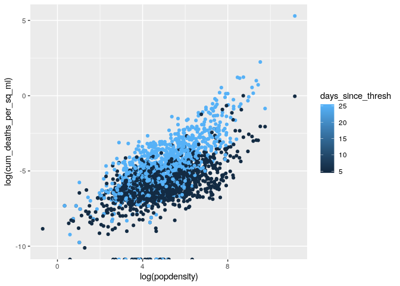

It is clear that lockdown has mitigated the spread of the 2019 novel coronavirus, but there is uncertainty by how much. During the first wave of Covid-19 there was an immediate need for models to determine the potential extent of the spread with stay at home orders in place. 

Now that we are leaving the first peak behind us, the priority of policy makers and modelers in the US has shifted towards quantifying the effect of lifting restrictions to maintain the epidemic's second wave under control.

Understanding the anatomy of mobility in each US county and measuring the causal effect of lockdown and other interventions on Covid-19 spread is key in guiding quick responses and identifying their risk while reopening the economy during this pandemic and others that might come.  


## Covid deaths per county 

Data pulled from New York Times and Johns Hopkins github repositories provide:

* up to date covid case and death counts in each US county
* county descriptive data 
* effective dates for local governments' policies and interventions put in place to contain the epidemic


```r
county_features <- read_feather("./county_features.feather")
```

A county is considered in the analysis once the number of COVID-19 deaths reaches a threshold of 3 deaths per 10,000,000 people. `days_since_thesh` records the number of days elapsed between the threshold and a given timestamp. 

Let's find the number of county records for each value of `days_since_thresh`. 


```r
county_features %>% 
  ggplot(aes(x = days_since_thresh)) +
  geom_histogram()
```

```
## `stat_bin()` using `bins = 30`. Pick better value with `binwidth`.
```

```
## Warning: Removed 341 rows containing non-finite values (stat_bin).
```

<!-- -->

For each county, what are the number of available records to date?


```r
county_features %>% 
  group_by(fips) %>% 
  summarize(fips_n = n()) %>% 
  ggplot(aes(x = fips_n)) +
  geom_histogram()
```

```
## `stat_bin()` using `bins = 30`. Pick better value with `binwidth`.
```

<!-- -->

What is the mean death rate per reported case for all US counties given the number of days since the threshold was reached?


```r
county_features %>% 
  group_by(days_since_thresh) %>% 
  summarise(mean_death_case_rate = mean(cum_deaths / cum_cases)) %>% 
  ggplot(aes(x = days_since_thresh, y = mean_death_case_rate)) + 
  geom_line()
```

```
## Warning: Removed 1 rows containing missing values (geom_path).
```

<!-- -->

## Population Density and Deaths

Because it is intuitive to believe that population density has an effect on the number of the deaths ocurring per sq mile in a given county, we will explore that relationship.


```r
county_features %>% 
  filter(days_since_thresh == 17) %>% 
  select(county, state, deaths_per_sq_mi, popdensity) %>% 
  arrange(desc(deaths_per_sq_mi))
```

```
## # A tibble: 1,216 x 4
##    county        state         deaths_per_sq_mi popdensity
##    <chr>         <chr>                    <dbl>      <dbl>
##  1 New York City New York                7.97       69468.
##  2 Hudson        New Jersey              0.671      13731.
##  3 Union         New Jersey              0.194       5216.
##  4 Nassau        New York                0.151       4705.
##  5 Philadelphia  Pennsylvania            0.149      11380.
##  6 Essex         New Jersey              0.127       6212.
##  7 Middlesex     New Jersey              0.126       2622.
##  8 Westchester   New York                0.0906      2205.
##  9 Orleans       Louisiana               0.0885      2029.
## 10 Suffolk       Massachusetts           0.0688     12416.
## # … with 1,206 more rows
```

There is a linear (log) relationship.


```r
county_features %>% 
  filter(days_since_thresh %in% c(5,25)) %>% 
  ggplot(aes(x=log(popdensity), y=log(cum_deaths_per_sq_mi), col=days_since_thresh)) +
  geom_point()
```

<!-- -->

There is reason to believe that, at $t$  days since the threshold, risk assessments on county death per sq mile are attainable using the counties population density (and probably an autoregression on previous death counts).


```r
lm(log(1 + cum_deaths_per_sq_mi) ~ log(popdensity), data=filter(county_features, days_since_thresh==25))
```

```
## 
## Call:
## lm(formula = log(1 + cum_deaths_per_sq_mi) ~ log(popdensity), 
##     data = filter(county_features, days_since_thresh == 25))
## 
## Coefficients:
##     (Intercept)  log(popdensity)  
##        -0.27684          0.06443
```

Therefore, cumulative deaths per square mile and population density in counties appear to have a relationship of the form:


$\text{cum_deaths_per_sq_mi} = 0.75 * \text{popdensity} ^ {0.07}$


we get 0.75 from the intercept ($\exp(-0.26)$) and $0.07$ from the $\beta$.


```r
x = seq(100, 5000, 100)
y = 0.75 * x ^ 0.065
plot(x,y)
```

<!-- -->


The next two plots compare the deaths per sq mile in `30661`New York City and `48453` Travis County (Austin City, TX). It looks like population density accelerates the deaths per sq mile growth rate (y in log scale). 


```r
county_features %>% 
  filter(fips %in% c(48453, 36061)) %>% 
  ggplot(aes(x=days_since_thresh, y=log(cum_deaths_per_sq_mi), col=fips)) +
  geom_point() + geom_line()
```

<!-- -->


```r
county_features %>% 
  filter(fips %in% c(48453, 36061)) %>% 
  ggplot(aes(x=days_since_thresh, y=log(deaths_per_sq_mi), col=fips)) +
  geom_point() + geom_line()
```

<!-- -->

The next plot show the relationship between the population density and the rural-urban variables in the US counties.


```r
county_features %>% 
  filter(days_since_thresh == 0) %>% 
  ggplot(aes(x = log(popdensity), y = log(rural_urban * urban_influence))) + 
  geom_point(alpha = 0.5)
```

<!-- -->

Finally, let's look at the rural-urban relationship with log cumulative deaths per sq mile and population density after 25 days have passed since the threshold was reached in a given county.  


```r
county_features %>% 
  filter(days_since_thresh == 25) %>% 
  ggplot(aes(x=log(rural_urban * urban_influence), y=log(cum_deaths_per_sq_mi), col=log(popdensity))) +
  geom_point() + 
  geom_jitter(width = 0.3) +
  labs(col = "")
```

<!-- -->

## Local policies and interventions

When did the interventions occurred? 

* Closing schools


```r
county_features %>% 
  distinct(fips, schools) %>% 
  pull(schools) %>% table()
```

```
## .
## 2020-03-16 2020-03-17 2020-03-18 2020-03-19 2020-03-20 2020-03-21 2020-03-24 
##         16       1229        403        520        387        200        367 
## 2020-04-03 
##         99
```

* Stay at home orders


```r
county_features %>% 
  distinct(fips, stayhome) %>% 
  pull(stayhome) %>% table()
```

```
## .
## 2020-03-20 2020-03-22 2020-03-23 2020-03-24 2020-03-25 2020-03-26 2020-03-27 
##         58        124         64        245        315        147        177 
## 2020-03-28 2020-03-29 2020-03-31 2020-04-01 2020-04-02 2020-04-03 2020-04-04 
##        109        115        360        109         64        258        212 
## 2020-04-05 2020-04-07 2020-04-08 
##         66        184         46
```

* In how many counties did the interventions occur after the thresh


```r
after_thresh <- county_features %>% 
  filter(days_since_thresh == 0) %>% 
  mutate(gt500_after_thresh = gt500 - date, 
         gt50_after_thresh = gt50 - date, 
         stayhome_after_thresh = stayhome - date, 
         schools_after_thresh = schools - date, 
         restaurants_after_thresh = restaurants - date, 
         entertainment_after_thresh = entertainment - date)

#total
length(unique(after_thresh$fips))
```

```
## [1] 1536
```

```r
#gt500
length(unique(after_thresh$fips[after_thresh$gt500_after_thresh > 0]))
```

```
## [1] 79
```

```r
#gt50
length(unique(after_thresh$fips[after_thresh$gt50_after_thresh > 0]))
```

```
## [1] 102
```

```r
#stayhome
length(unique(after_thresh$fips[after_thresh$stayhome_after_thresh > 0]))
```

```
## [1] 313
```

```r
#schools
length(unique(after_thresh$fips[after_thresh$schools_after_thresh > 0]))
```

```
## [1] 52
```

```r
#restaurants
length(unique(after_thresh$fips[after_thresh$restaurants_after_thresh > 0]))
```

```
## [1] 74
```

```r
#entertainment
length(unique(after_thresh$fips[after_thresh$entertainment_after_thresh > 0]))
```

```
## [1] 110
```

* How many observations per county we have before the stay at home orders were put in place?


```r
county_features %>%
  filter(days_since_thresh >= 0, 
         days_after_stayhome <= 0) %>% 
  group_by(fips) %>% 
  summarise(n_days_before_intervention = n()) %>% 
  ggplot(aes(x = n_days_before_intervention)) + 
  geom_histogram()
```

```
## `stat_bin()` using `bins = 30`. Pick better value with `binwidth`.
```

<!-- -->


**Next steps**

A preliminary analysis of the effect of the interventions or policies by building a hierarchical bayesian model:

* that forecasts the death counts for a given county with information of the evolution of the epidemic from its peers
* whose covariates include whether interventions (or policies) were in place
