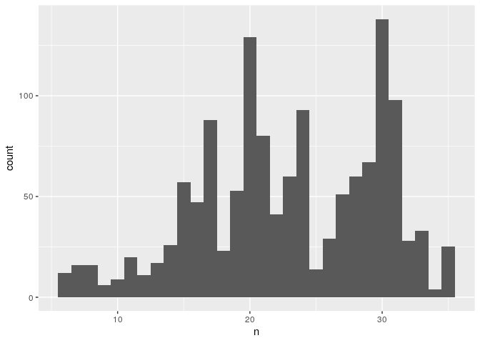
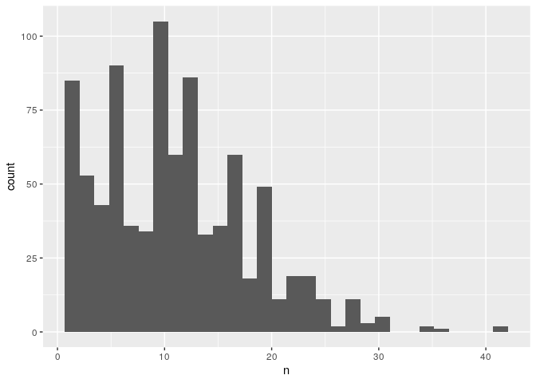
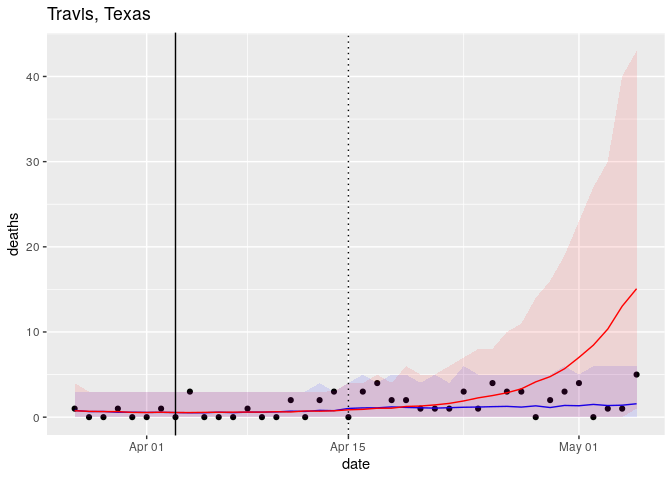
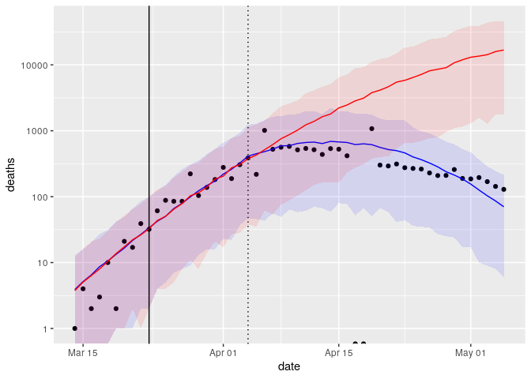
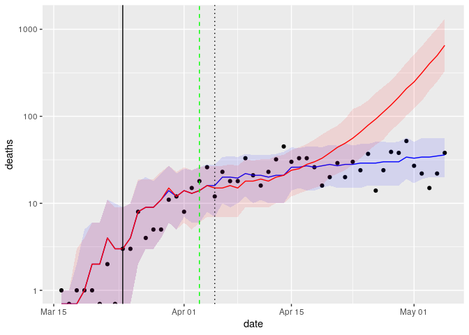
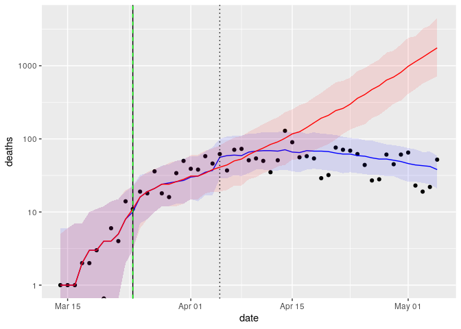

A simple version of a (bayesian hierarchical) model is trained. 

The model formulation looks like this

$y_{it} \sim \mathrm{NegBin}(\lambda_{it}, r)$

$\log\lambda_{it} = \beta_{i0} +\beta_{i1}t + \beta_{i2} t^2 + \log N_i$

$[\beta_{i0}, \beta_{i1}, \beta_{i2}]^\top \sim N(\mu, \Sigma)$

The rstan code looks like this

```{}
deaths_model = stan_glmer.nb(
  deaths ~
    poly(days_since_thresh, 2) * (intervention) +
    (poly(days_since_thresh, 2) | fips),
  offset = log(pop), 
  data=county_features, 
  algorithm = "meanfield")
```

The effect of policies or interventions will be explored.


```r
## Read data

county_features <- read_feather("county_features.feather")

## Remove rows with negative days_since_thresh
county_features %<>% 
  filter(days_since_thresh >= 0)

## Remove timestamps with negative counts
county_features <- county_features[-which(county_features$deaths < 0), ]

## Require at least 5 days since threshold
remove_fips <- county_features %>% 
  group_by(fips) %>% 
  summarise(max_days = max(days_since_thresh)) %>% 
  filter(max_days < 5) %>% 
  pull(fips)

county_features <- county_features[!county_features$fips %in% remove_fips, ]
```

### Model: Fit deaths with stay at home order by county

Let's **fit** daily deaths.


```r
county_features <- county_features %>% 
  select(fips, 
         county, 
         state, 
         date, 
         threshold_day,
         days_since_thresh,
         stayhome, 
         days_after_stayhome,
         pop,
         deaths,
         stayhome_state, pop_state)
```

The **intervention** is a dummy varible. It will take 12 days after the stay home order for us to consider the intervention as active (1). This is because the disease becomes a threat to a person's life after infection and complications, not immediately. 


```r
## Remove counties that did not put the intervention in place
county_features %<>% 
  filter(!is.na(stayhome))

## Create intervention dummy covariate
county_features %<>% 
  mutate(intervention = (days_after_stayhome >= 12) * 1)
```

Number of counties that satisfy conditions


```r
length(unique(county_features$fips))
```

```
## [1] 1351
```

Number of timestamps per county with active intervention


```r
county_features %>% 
  group_by(fips) %>% 
  filter(intervention == 1) %>% 
  summarise(n = n()) %>% 
  ggplot(aes(x = n)) +
  geom_histogram()
```

```
## `stat_bin()` using `bins = 30`. Pick better value with `binwidth`.
```

<!-- -->

Number of timestamps per county without intervention


```r
county_features %>% 
  group_by(fips) %>% 
  filter(intervention == 0) %>% 
  summarise(n = n()) %>% 
  ggplot(aes(x = n)) +
  geom_histogram()
```

```
## `stat_bin()` using `bins = 30`. Pick better value with `binwidth`.
```

<!-- -->

### Fit

```{}
county_model = stan_glmer.nb(
  deaths ~
    poly(days_since_thresh, 2) * (intervention) +
    (poly(days_since_thresh, 2) | fips),
  offset = log(pop), 
  data=county_features, 
  algorithm = "meanfield")

saveRDS(county_model, "./vanilla_model_1.rds")
```

Generate posterior values


```r
county_model <- readRDS("./vanilla_model_1.rds")

county_fit <- county_model %>% 
  posterior_predict(county_features)
```

### Counterfactual

What would have happened if the intervention never existed?


```r
county_features$intervention_fit <- county_features$intervention
county_features$intervention <- 0

county_ctr <- county_model %>% 
  posterior_predict(county_features)
```

### Effect of intervention

Get posterior statistics for each county


```r
county_features %<>% 
  mutate(
    fit_mu = apply(county_fit, 2, mean),
    fit_med = apply(county_fit, 2, quantile, probs = 0.5), # use posterior median to hand skewness
    fit_lo = apply(county_fit, 2, quantile, probs = 0.025),
    fit_hi = apply(county_fit, 2, quantile, probs = 0.975)) 
```

Posterior statistics for each county as if intervention never existed


```r
county_features %<>% 
  mutate(
    ctr_mu = apply(county_ctr, 2, mean),
    ctr_med = apply(county_ctr, 2, quantile, probs = 0.5), # use posterior median to hand skewness
    ctr_lo = apply(county_ctr, 2, quantile, probs = 0.025),
    ctr_hi = apply(county_ctr, 2, quantile, probs = 0.975))
```

The next plots show the resulting effect of the intervention in two counties:

* Blue is the fit
* Red is the counterfactual

The difference between the red and black line is the effect of the stay at home intervention.

**stay at home effect in Austin, Texas**


```r
p <- county_features %>%
  filter(fips == 48453) %>%
  ggplot() +
  geom_point(aes(x=date, y=deaths)) + 
  geom_line(aes(x=date, y=fit_mu), 
            col = "blue") +
  geom_ribbon(aes(x=date, ymin=fit_lo, ymax=fit_hi), 
              alpha= 0.1, 
              fill = "blue") +
  geom_line(aes(x=date, y=ctr_mu), 
            col = "red") +
  geom_ribbon(aes(x=date, ymin=ctr_lo, ymax=ctr_hi), 
              alpha= 0.1, 
              fill = "red") + 
  geom_vline(aes(xintercept = stayhome)) + 
  geom_vline(aes(xintercept = stayhome + 12), linetype="dotted")+ 
  labs(title = "Travis, Texas")
p
```

<!-- -->


```r
ggsave("travis_deaths.png", p, width = 5, height = 3)
```

**stay at home effect in New York City**


```r
county_features %>%
  filter(fips == 36061) %>%
  ggplot() +
  geom_point(aes(x=date, y=deaths)) + 
  geom_line(aes(x=date, y=fit_mu), 
            col = "blue") +
  geom_ribbon(aes(x=date, ymin=fit_lo, ymax=fit_hi), 
              alpha= 0.1, 
              fill = "blue") +
  geom_line(aes(x=date, y=ctr_mu), 
            col = "red") +
  geom_ribbon(aes(x=date, ymin=ctr_lo, ymax=ctr_hi), 
              alpha= 0.1, 
              fill = "red") + 
  geom_vline(aes(xintercept = stayhome)) + 
  geom_vline(aes(xintercept = stayhome + 12), linetype="dotted") + 
  scale_y_log10()
```

```
## Warning: Transformation introduced infinite values in continuous y-axis

## Warning: Transformation introduced infinite values in continuous y-axis

## Warning: Transformation introduced infinite values in continuous y-axis
```

<!-- -->

Generate log deaths report for californian counties.


```r
fips_name <- county_features %>% 
  filter(state == "California") %>% 
  distinct(fips, pop) %>% 
  arrange(desc(pop)) %>% 
  pull(fips)
```


```r
gg_county_log_deaths <- function(fips_name) {
  county_name <- distinct(county_features, fips, county) %>% 
    filter(fips == fips_name) %>% pull(county)
  
  p <- county_features %>% 
    filter(fips == fips_name) %>% 
    ggplot() + 
    geom_point(aes(x=date, y=deaths)) + 
    geom_line(aes(x=date, y=fit_med), 
            col = "blue") + 
    geom_ribbon(aes(x=date, ymin=fit_lo, ymax=fit_hi), 
              alpha= 0.1, 
              fill = "blue") + 
    geom_line(aes(x=date, y=ctr_med), 
            col = "red") + 
    geom_ribbon(aes(x=date, ymin=ctr_lo, ymax=ctr_hi), 
              alpha= 0.1, 
              fill = "red") + 
  geom_vline(aes(xintercept = stayhome)) + 
  geom_vline(aes(xintercept = stayhome + 12), linetype="dotted") +
  scale_y_log10() + 
    labs(title = county_name, 
         x = "", y = "")
  p
}
```


### Aggregated effect of intervention by state


```r
state_features <-  county_features %>% 
  group_by(state, stayhome_state, pop_state) %>% 
  summarise(threshold_day = min(threshold_day), 
            stayhome = min(stayhome)) %>% 
  ungroup()

state_features <- county_features %>% 
  group_by(state, date) %>% 
  summarise(deaths = sum(deaths), 
            fit_mu = NA, 
            fit_med = NA, 
            fit_lo = NA, 
            fit_hi = NA,
            ctr_mu = NA, 
            ctr_med = NA, 
            ctr_lo = NA, 
            ctr_hi = NA) %>% 
  ungroup() %>% 
  left_join(state_features) %>% 
  mutate(days_after_stayhome = date - stayhome)
```

```
## Joining, by = "state"
```

Let's get a state fit and counterfactual by aggregating the posteriors of the counties in each state


```r
for(s in unique(state_features$state)){
  #print(s)
  dates <- state_features$date[which(state_features$state == s)]
    for(d in dates) {
      county_idx <- which(county_features$state == s & 
                            county_features$date == d)
      if(length(county_idx) > 1) {
        fit <- apply(county_fit[, county_idx],1,sum)
        ctr <- apply(county_ctr[, county_idx],1,sum)
      } else {
        fit <- county_fit[, county_idx]
        ctr <- county_ctr[, county_idx]
      }
      state_idx <- which(state_features$state == s & 
                           state_features$date == d)
      
      state_features$fit_mu[state_idx] <- mean(fit)
      state_features$fit_med[state_idx] <- quantile(fit, 0.5)
      state_features$fit_lo[state_idx] <- quantile(fit, 0.025)
      state_features$fit_hi[state_idx] <- quantile(fit, 0.975)
      
      state_features$ctr_mu[state_idx] <- mean(ctr)
      state_features$ctr_med[state_idx] <- quantile(ctr, 0.5)
      state_features$ctr_lo[state_idx] <- quantile(ctr, 0.025)
      state_features$ctr_hi[state_idx] <- quantile(ctr, 0.975)
    }
}
```

**stay at home effect in Texas**


```r
state_features %>%  
  filter(state == "Texas") %>% 
  ggplot() +
  geom_point(aes(x=date, y=deaths)) + 
  geom_line(aes(x=date, y=fit_med), 
            col = "blue") +
  geom_ribbon(aes(x=date, ymin=fit_lo, ymax=fit_hi), 
              alpha= 0.1, 
              fill = "blue") +
  geom_line(aes(x=date, y=ctr_med), 
            col = "red") +
  geom_ribbon(aes(x=date, ymin=ctr_lo, ymax=ctr_hi), 
              alpha= 0.1, 
              fill = "red") + 
  geom_vline(aes(xintercept = stayhome)) + 
  geom_vline(aes(xintercept = stayhome_state), linetype="dashed", col = "green") + 
  geom_vline(aes(xintercept = stayhome + 12), linetype="dotted") +
  scale_y_log10()
```

```
## Warning: Transformation introduced infinite values in continuous y-axis

## Warning: Transformation introduced infinite values in continuous y-axis

## Warning: Transformation introduced infinite values in continuous y-axis

## Warning: Transformation introduced infinite values in continuous y-axis

## Warning: Transformation introduced infinite values in continuous y-axis
```

<!-- -->

**stay at home effect in Lousiana**


```r
state_features %>%  
  filter(state == "Louisiana") %>% 
  ggplot() +
  geom_point(aes(x=date, y=deaths)) + 
  geom_line(aes(x=date, y=fit_med), 
            col = "blue") +
  geom_ribbon(aes(x=date, ymin=fit_lo, ymax=fit_hi), 
              alpha= 0.1, 
              fill = "blue") +
  geom_line(aes(x=date, y=ctr_med), 
            col = "red") +
  geom_ribbon(aes(x=date, ymin=ctr_lo, ymax=ctr_hi), 
              alpha= 0.1, 
              fill = "red") + 
  geom_vline(aes(xintercept = stayhome)) + 
  geom_vline(aes(xintercept = stayhome_state), linetype="dashed", col = "green") + 
  geom_vline(aes(xintercept = stayhome + 12), linetype="dotted") +
  scale_y_log10()
```

```
## Warning: Transformation introduced infinite values in continuous y-axis

## Warning: Transformation introduced infinite values in continuous y-axis

## Warning: Transformation introduced infinite values in continuous y-axis
```

<!-- -->

Generate log deaths report for all states.


```r
state_name <- state_features %>% 
  distinct(state, pop_state) %>% 
  arrange(desc(pop_state)) %>% 
  pull(state)
```


```r
gg_state_log_deaths <- function(state_name) {
  p <- state_features %>% 
    filter(state == state_name) %>% 
    ggplot() + 
    geom_point(aes(x=date, y=deaths)) + 
    geom_line(aes(x=date, y=fit_med), 
            col = "blue") + 
    geom_ribbon(aes(x=date, ymin=fit_lo, ymax=fit_hi), 
              alpha= 0.1, 
              fill = "blue") + 
    geom_line(aes(x=date, y=ctr_med), 
            col = "red") + 
    geom_ribbon(aes(x=date, ymin=ctr_lo, ymax=ctr_hi), 
              alpha= 0.1, 
              fill = "red") + 
  geom_vline(aes(xintercept = stayhome)) + 
  geom_vline(aes(xintercept = stayhome_state), linetype="dashed", col = "green") + 
  geom_vline(aes(xintercept = stayhome + 12), linetype="dotted") +
  scale_y_log10() + 
    labs(title = state_name, 
         x = "", y = "")
  p
}
```


Generate cum deaths report for all states.


```r
state_features %<>% 
  arrange(state, date) %>% 
  group_by(state) %>% 
  mutate(cum_deaths = cumsum(deaths), 
         cum_fit_mu = cumsum(fit_mu), 
         cum_ctr_mu = cumsum(ctr_mu), 
         effect = cum_ctr_mu - cum_fit_mu) %>% 
  ungroup()
```


```r
gg_state_cum_deaths <- function(state_name, days_effect = NA) {
  features <- state_features %>% filter(state == state_name)
  if(!is.na(days_effect)) features %<>% filter(days_after_stayhome <= days_effect)
  
  p <- features %>% 
    ggplot() + 
    geom_point(aes(x=date, y=cum_deaths)) + 
    geom_line(aes(x=date, y=cum_fit_mu), col = "blue") + 
    geom_line(aes(x=date, y=cum_ctr_mu), col = "red") + 
  geom_vline(aes(xintercept = stayhome)) + 
  geom_vline(aes(xintercept = stayhome_state), linetype="dashed", col = "green") + 
  geom_vline(aes(xintercept = stayhome + 12), linetype="dotted") + 
    labs(title = state_name, 
         x = "", y = "")
  p
}
```


Show effect of intervention after 25 days of being imposed in a county.


```r
state_features  %>% 
  filter(days_after_stayhome == 25) %>% 
  select(state, date, cum_deaths, cum_fit_mu, cum_ctr_mu, effect) %>% 
  arrange(desc(effect)) %>% 
  mutate(total_deaths = cumsum(cum_deaths), 
         total_effect = cumsum(effect))
```

```
## # A tibble: 45 x 8
##    state date       cum_deaths cum_fit_mu cum_ctr_mu effect total_deaths
##    <chr> <date>          <dbl>      <dbl>      <dbl>  <dbl>        <dbl>
##  1 New … 2020-04-17      12249     13082.     23716. 10634.        12249
##  2 Wash… 2020-04-18        635       661.      3843.  3181.        12884
##  3 New … 2020-04-16       3517      3321.      4192.   871.        16401
##  4 Mich… 2020-04-19       2372      2674.      3522.   848.        18773
##  5 Sout… 2020-05-03        277       284.       913.   629.        19050
##  6 Mary… 2020-04-25        731       669.      1210.   541.        19781
##  7 Neva… 2020-04-27        207       188.       699.   511.        19988
##  8 Loui… 2020-04-18       1288      1310.      1677.   367.        21276
##  9 Dist… 2020-04-27        185       169.       420.   251.        21461
## 10 Flor… 2020-04-20        826       859.      1071.   212.        22287
## # … with 35 more rows, and 1 more variable: total_effect <dbl>
```


Show effect of intervention after 35 days of being imposed in a county.


```r
state_features %>% 
  mutate(days_after_stayhome = date - stayhome, 
         effect = cum_ctr_mu - cum_fit_mu) %>% 
  filter(days_after_stayhome == 35) %>% 
  select(state, date, cum_deaths, cum_fit_mu, cum_ctr_mu, effect) %>% 
  arrange(desc(effect)) %>% 
  mutate(total_deaths = cumsum(cum_deaths), 
         total_effect = cumsum(effect))
```

```
## # A tibble: 40 x 8
##    state date       cum_deaths cum_fit_mu cum_ctr_mu effect total_deaths
##    <chr> <date>          <dbl>      <dbl>      <dbl>  <dbl>        <dbl>
##  1 New … 2020-04-27      17360     19739.     92391. 72652.        17360
##  2 Wash… 2020-04-28        798       827.     51046. 50219.        18158
##  3 New … 2020-04-26       5941      6201.     21937. 15736.        24099
##  4 Mich… 2020-04-29       3638      4025.     12238.  8213.        27737
##  5 Mary… 2020-05-05       1266      1139.      8450.  7311.        29003
##  6 Flor… 2020-04-30       1272      1365.      7902.  6537.        30275
##  7 Mass… 2020-04-29       3402      3007.      7845.  4838.        33677
##  8 Conn… 2020-04-28       2089      2598.      7305.  4708.        35766
##  9 Loui… 2020-04-28       1787      1934.      5641.  3706.        37553
## 10 Virg… 2020-05-05        717       748.      4159.  3411.        38270
## # … with 30 more rows, and 1 more variable: total_effect <dbl>
```
